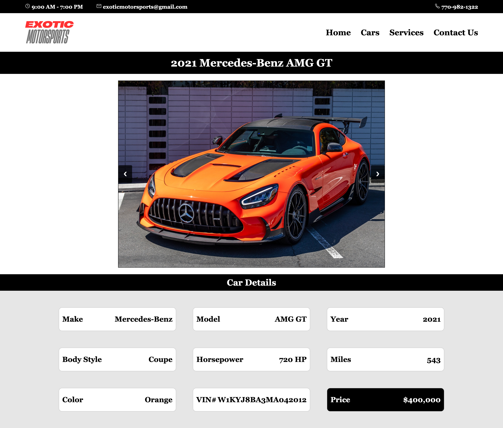

# Exotic Motorsports

Exotic Motorsports is a web application that allows users to browse vehicles available at the dealership and schedule a variety of automotive services.

Users can search for a specific vehicle using its VIN number and view detailed listings for each car. Every listing includes a looping image gallery with forward and backward navigation, along with detailed vehicle specifications.

The service page allows users to select from multiple services, including oil changes, car wraps, new wheels, and window tinting. Selected services are added to a checkout cart, where users can schedule their service appointment.

The application also includes a contact page that provides dealership information such as the address, staff details, and available methods of contact.

## Screenshots

### Home Page

### Cars Page

### Vehicle Details

### Services Page

### Checkout Page

### Contact Page

